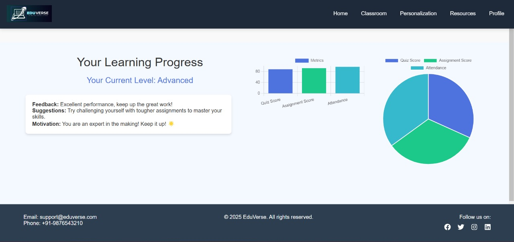

<h1>🌍 EduVerse – Where AI Meets VR for Seamless Learning</h1>

  🔗 <strong>Live Link:</strong> <a href="https://eduverse-iaavc5w99-tanya-agrawals-projects.vercel.app/" target="_blank">EduVerse Website</a> 
  📄 <strong>Presentation:</strong> <a href="https://www.canva.com/design/DAGfFZELJnk/Hne1OtqFt08t1nLSuGWHHQ/edit?utm_content=DAGfFZELJnk&utm_campaign=designshare&utm_medium=link2&utm_source=sharebutton" target="_blank">EduVerse PPT</a> 
  🌐 <strong>VR Link:</strong> <a href="https://tanya-2004.github.io/EduVerse/" target="_blank">EduVerse VR</a>

<h2>🚨 Problem Statement</h2>

  Students today face significant challenges with traditional education methods, which often lack engagement, personalization, and practical learning opportunities. 
  Long commutes and time-consuming logistics not only exhaust students but also increase costs, contributing to educational inequality. 
  Despite rapid technological advancements, their integration into education remains minimal, hindering students from reaching their full potential.

<h3>🎯 SDGs Addressed:</h3>
<ul>
  <li>🏫 <strong>SDG 4:</strong> Quality Education</li>
  <li>⚖️ <strong>SDG 10:</strong> Reduced Inequalities</li>
</ul>

<h3>🚀 Tracks Covered:</h3>
<ul>
  <li>✨ Youth Empowerment</li>
  <li>🌱 Social Impact</li>
</ul>

<h2>💡 Our Solution</h2>

  EduVerse is a full-stack AI-powered, VR-enhanced platform that delivers personalized, immersive learning. 
  Our goal is to help students focus on their education without unnecessary obstacles.

<h3>🌟 Key Features:</h3>
<ul>
  <li><strong>AI Personalization (USP):</strong> Adaptive learning paths tailored to each student’s strengths, weaknesses, and pace using OpenAI’s analysis and recommendations.</li>
  <li><strong>VR-Classroom (USP):</strong> Real-time lectures, virtual lab experiments, and history tours for interactive, practical learning.</li>
  <li><strong>Class & Notes Upload:</strong> Effortlessly upload class recordings and summaries, providing students with quick and easy access to key concepts for efficient revision.</li>
  <li><strong>Customized AI Chatbot:</strong> Instant doubt resolution and academic assistance, leveraging OpenAI and Botpress.</li>
  <li><strong>Comprehensive Resources:</strong> A centralized system offering study materials, assignments, and curated resources for both students and teachers.</li>
</ul>

<h2>🛠️ Tech Stack</h2>
<ul>
  <li><strong>Frontend:</strong> React.js with CSS</li>
  <li><strong>Backend:</strong> Node.js + Express.js</li>
  <li><strong>Database:</strong> MongoDB</li>
  <li><strong>VR Development:</strong> Unity + WebGL</li>
  <li><strong>AI Integration:</strong> Gemini API</li>
  <li><strong>Data Visualization:</strong> Chart.js</li>
  <li><strong>Bot Development:</strong> Botpress</li>
</ul>

<h2>📸 Screenshots</h2>

  
  
  

  
  
  

  
  
  

  
  
  

